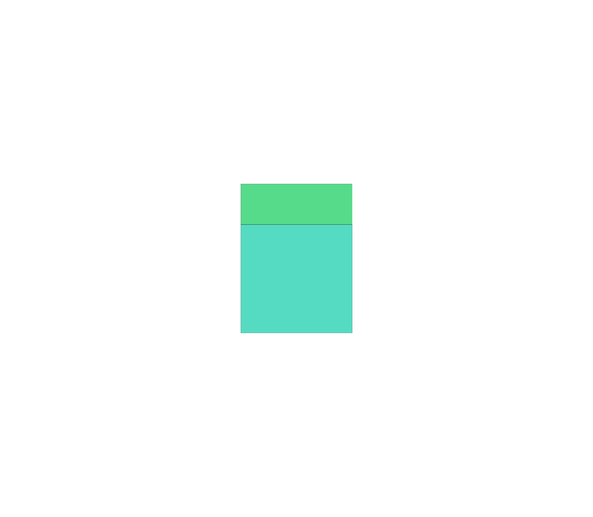

# PatchUp

The repo is not fully ready for use yet and please expect more detailed documentation and cleaner code in a few months.

## Repo setup

`conda create -n <newenv> python=3.11`
(It's not necessary to specify the python version)

`conda activate <newenv>`

`pip install flask flask-cors python-dotenv dill pillow seaborn` (likely a few more packages)

`npx create-react-app <folder-name> <--skip-git-init>`

## Gurobi Setup

`export GRB_LICENSE_FILE=<path to gurobi.lic>`

## Running the app

`cd <folder-name>`
(right now folder-name could be either image_segmentation or ui)

`npm install`

`conda activate <newenv>`

`npm run start-api`

`npm run start`

## Running precomputation

`python scripts/compute_input_overlay.py image_segmentation/public/images/fish1.png`

`python scripts/compute_scrap_overlay.py image_segmentation/public/images/scraps5.jpg 9`
(the argument '9' which is number of images to segment for counted the calibration square as well)
